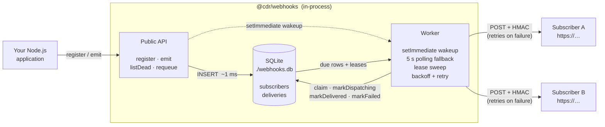
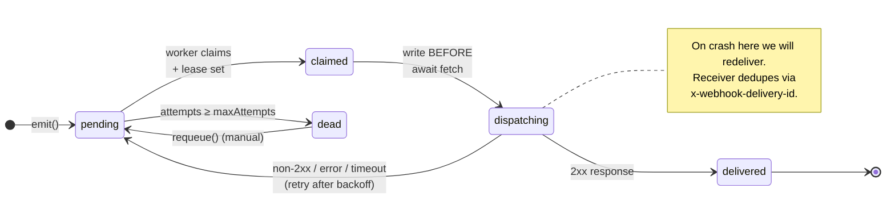

# @cdr/webhooks

Embeddable, durable webhook delivery for Node.js. A single `import`, a SQLite file, and a hybrid in-process worker — no Redis, no broker, no separate service.

```ts
import { createWebhooks } from '@cdr/webhooks';

const webhooks = createWebhooks({ signingSecret: process.env.WEBHOOK_SECRET! });

await webhooks.register('order.created', 'https://example.com/hook');
await webhooks.emit('order.created', { orderId: 123 });
```

`emit()` is bounded by a local SQLite transaction — it does **not** await the subscriber's HTTP request. A worker drains the queue asynchronously, retries with exponential backoff, and resumes any work in flight on restart.

---

## Quick start

```bash
pnpm install
pnpm test         # 6 tests; ~600 ms
pnpm typecheck
```

> **For QA:** a step-by-step manual test plan with expected output for every guarantee — see [`docs/manual-test-plan.md`](docs/manual-test-plan.md).

### Run the example app

Two terminals.

```bash
# terminal 1 — receiver (will fail twice then succeed, to demo retries)
FAIL_UNTIL=2 pnpm example:receiver

# terminal 2 — emit a single order.created event
pnpm example:emitter
```

You should see, in the receiver log:

```
[receiver] forcing failure 1/2 for order.created 9be933ad-...
[receiver] forcing failure 2/2 for order.created 9be933ad-...
[receiver] OK order.created delivery=9be933ad-... body={"orderId":24221,...}
```

All three attempts carry the same `x-webhook-delivery-id` — that's the row UUID, used by receivers to dedupe.

---

## API

```ts
const webhooks = createWebhooks({
  signingSecret: 'shared-secret-with-receivers',  // required
  dbPath: './webhooks.db',                         // default
  maxAttempts: 8,                                  // default
  baseRetryDelayMs: 1_000,                         // default
  maxRetryDelayMs: 60_000,                         // default
  requestTimeoutMs: 10_000,                        // default
  pollIntervalMs: 5_000,                           // default
  leaseMs: 60_000,                                 // default; must be > requestTimeoutMs
  autoStart: true,                                 // default
});

await webhooks.register(eventName, url);          // → { id }
await webhooks.emit(eventName, payload);           // → { deliveryIds }

// Admin / observability
const dead = await webhooks.listDead({ limit: 100 });   // inspect dead-lettered rows
await webhooks.requeue(deliveryId);                      // retry one manually

await webhooks.close();
```

Outgoing requests carry these headers:

| Header | Purpose |
|---|---|
| `x-webhook-event` | event name |
| `x-webhook-delivery-id` | row UUID — stable across retries; **use for receiver dedup** |
| `x-webhook-timestamp` | unix ms when this attempt was sent |
| `x-webhook-signature` | `sha256=<hex>` HMAC over `${timestamp}.${body}` |

`verify(secret, ts, body, signature)` is exported for receivers; the example app uses it.

---

## How delivery works

### Architecture at a glance

The library is a single process boundary: your application code, the public API, the worker, and the SQLite file all live in **one Node.js process**. Subscribers are the only external systems.



Two key things to read off this picture:

1. **`emit()` only touches the local SQLite file.** The dotted arrow to the worker is a `setImmediate` nudge — it doesn't await any network. That's why `emit()` returns in ~1 ms regardless of subscriber latency.
2. **The worker is the only thing that talks to subscribers.** Retries, backoff, and lease-sweep recovery all happen behind that boundary. The application never sees a failed delivery on its hot path.

### State machine

Each `(event, subscriber)` pair becomes one row in `deliveries`. The row moves through:



The transition `claimed → dispatching` is committed to disk **before** the HTTP request is awaited. That's the row that says *"we may already have sent this."*

Two recovery mechanisms backstop this:

- **Boot recovery** — on `createWebhooks()` start-up, every row left in `claimed` or `dispatching` is reset to `pending`. Handles `kill -9` mid-fetch.
- **Lease sweep** — every claimed row carries a `lease_expires_at`. The polling tick resets any row whose lease has expired back to `pending`. Handles a worker that hangs inside a still-alive process. The lease is set to `leaseMs` (default 60 s, validated to be greater than `requestTimeoutMs` so a healthy slow fetch is never reaped).

### Dispatch (hybrid)

`emit()` does N inserts in one transaction (one per registered subscriber), commits, then schedules a worker tick via `setImmediate`. A 5 s polling timer also fires to handle retries that come due and to sweep recovered rows. Pure polling is too lazy; pure event-driven loses retries on its own.

### Backoff

`baseRetryDelayMs * 2^(attempt - 1)` capped at `maxRetryDelayMs`, with equal-jitter — half deterministic, half random — to spread thundering herds without collapsing the lower bound.

---

## Delivery guarantees

| Guarantee | Holds because |
|---|---|
| **At-least-once** | Every state transition is committed before the next side effect. A dispatch crash redelivers. |
| **Durable across restarts** | All state lives in SQLite (WAL mode, `synchronous=NORMAL`). On boot, in-flight rows are reset to pending. |
| **Caller-decoupled** | `emit()` only awaits a local DB transaction. In the smoke test it returns in **~1 ms** even when subscribers are failing. |
| **Idempotent registration** | `register(event, url)` is `INSERT ... ON CONFLICT DO NOTHING`; calling it on every boot is fine. |

We do **not** offer:

- **Exactly-once** — we send `x-webhook-delivery-id` so receivers can dedupe. The receiver in `examples/order-app/receiver.ts` shows the pattern.
- **Ordering across deliveries** — see "tradeoff to revisit" below.
- **Multi-process workers** — see "limitations" below.

---

## Limitations (be honest about them)

- **Single Node process per database file.** Two processes pointing at the same SQLite file will at best contend on the writer lock and at worst double-dispatch a row. If you need to scale out workers, run them against Postgres + `SELECT FOR UPDATE SKIP LOCKED` (or move to a real broker). The library is designed to be embedded inside one app server, not run as a fleet.
- **Native module.** `better-sqlite3` builds from source on `pnpm install` (pnpm 9+ requires `pnpm.onlyBuiltDependencies` allow-listing — already configured in `package.json`). First install takes ~15 s and needs a working C++ toolchain.
- **Polling fallback wakes the event loop every 5 s** even when idle. Negligible CPU but not zero. Tunable via `pollIntervalMs`.

---

## The one tradeoff I'd revisit with more time

**Per-key FIFO ordering.** Today fan-out is unordered: two `order.updated` events for the same `orderId` may arrive at the subscriber out of order if attempt 1 fails and retries while attempt 2 succeeds on the first try. For many use cases that's fine; for state-replication use cases it's a footgun.

Adding ordering would mean a `partition_key` column, per-partition serial dispatch, and accepting head-of-line blocking — a stuck `orderId=42` blocks every other `orderId=42` event behind it. **It's a product decision, not an infra one,** and it should be made before shipping to any real consumer.

I picked this over the more obvious "polling vs Redis/BullMQ" tradeoff because polling-vs-broker is table stakes, whereas ordering is the question that actually bites you when a real customer hooks this up to a state machine.

---

## Project layout

```
src/
  index.ts        public createWebhooks(), exports
  store.ts        SQLite schema + queries
  worker.ts       hybrid dispatcher, backoff, recovery
  signing.ts      HMAC sign/verify
  backoff.ts      jittered exponential backoff
  types.ts
test/
  webhooks.test.ts   6 tests: emit, signing, fan-out, retry, dead-letter, recovery
examples/order-app/
  receiver.ts     Express server that verifies HMAC + dedupes by delivery id
  emitter.ts      one-shot emit demo
docs/decisions/
  0001-webhook-library-stack.md   ADR — full design rationale
PROMPTS.md        AI-assisted process notes for the follow-up interview
```

---

## License

MIT — see `LICENSE`.
